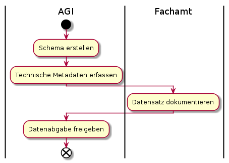

# Metamodelle

## Map

### Beispielkonfigurationen und resultierende Einträge in PS - DSL - SL:

* Einzel publiziertes DS: Kein Eintrag in DSL
* Einzel publizierter FL: Kein Eintrag in DSL
* LG mit FL und DS: Ein Eintrag in DSL. Je ein Eintrag fuer FL und DS in der PIL   
* Vordergrund-Karte (Map) mit LG1 und FL2: 
  * Je ein Eintrag in DSL fuer LG1 und FL2.
  * FL2 hat einen, LG1 mehrere Eintraege in der PIL.
* Hintergrund-Karte (Map) mit FL3 und FL4
  * Je ein Eintrag in DSL fuer FL3 und FL4 mir foreground=false.
  * FL3 und FL4 haben je einen Eintrag in der PIL
    
### Baumtiefe (Theoretisch unendliche Verschachtelung von DataProducts)
    
Die unendliche Verschachtelung wird aufgelöst und in die Beziehungskette PS - DSL - SL überführt. 
Maximal mögliche Verschachtelung: Layergruppe (oder Map) enthält DataSets und Facadelayer. 
Facadelayer enthalten wiederum DataSets (Ueber Beziehung FL - DS)

### DataSet - DataSetView

Die Unterscheidung, ob eine Tabelle eine Geometriespalte hat oder nicht erfolgt neu über eine Vererbungsbeziehung
und nicht über eine Assoziation. Die DataSetView entspricht neu der Klasse VectorDS. Im eher seltenen Fall der 
Publikation einer "Geotabelle" mit mehreren Darstellungen / unterschiedlichen Berechtigungen, ... müssen 
entsprechend mehrere VectorDS-Objekte erfasst werden. 

### Layergroup

Umfasst genau eine DSL (Darf im Unterschied zur Map nicht mehrere DSL umfassen).

### Map

Die Map ist keine "ganzheitliche" Karte im Sinne von "Zusammenstellung aus Vordergrundebenen und einer Hintergrundebene".
Eine Map ist entweder eine Vordergrund- oder eine Hintergrundkarte, entsprechend dem "Paradigma" des Web GIS Client.

Im Gegensatz zu einer Layergroup kann eine Map mehrere DSL's enthalten.

## Data

Stellt die Klassen des Datenkonfigurationsteils dar
* Tabellarische Daten aus Postgres/PostGIS mit und ohne Geometrie
* Rasterdaten aus einem File / einem Katalog

# Ablauf der Metadatenerfassung

## Bisheriger Ablauf

## Neuer Ablauf

## Ablaufanpassungen des bisherigen auf den neuen Ablauf
* Schemaerstellung wird durch Modellerstellung abgelöst
* Beidseitiges Vieraugenprinzip:
  * Fachamt prüft, ob das technische Setup korrekt ist - Sprich ob eine Kartenebene grundsätzlich geladen wird
  * AGI prüft, ob die vom Fachamt gesetzte Darstellung, Bezeichnungen, Beschreibungen den Richtlinien entspricht
* AGI gibt die Publikation auf allen "Kanälen" frei. Wenn nicht anders definiert werden die Daten sowohl für den 
Bezug in Rohdatenform (Datenabgabe, WF) wie auch für den Bezug in Kartenform (WMS, WGC, QGIS Desktop) freigegeben.

