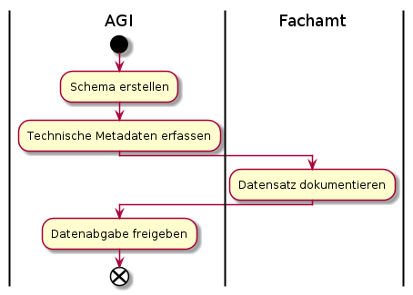
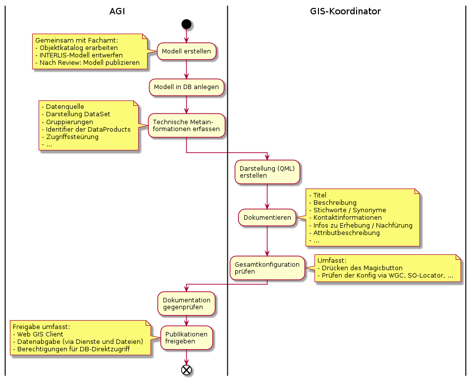

# Ablauf der Metadatenerfassung

## Bisheriger Ablauf

## Neuer Ablauf

## Ablaufanpassungen des bisherigen auf den neuen Ablauf
* Schemaerstellung wird durch Modellerstellung abgelöst
* Beidseitiges Vieraugenprinzip:
  * Fachamt prüft, ob das technische Setup korrekt ist - Sprich ob eine Kartenebene grundsätzlich geladen wird
  * AGI prüft, ob die vom Fachamt gesetzte Darstellung, Bezeichnungen, Beschreibungen den Richtlinien entspricht
* AGI gibt die Publikation auf allen "Kanälen" frei. Wenn nicht anders definiert werden die Daten sowohl für den 
Bezug in Rohdatenform (Datenabgabe, Dataservice, WFS) wie auch für den Bezug in Kartenform (WMS, WGC, QGIS Desktop) freigegeben.

## Wo ist der Master der Attributbeschreibung?

**In der Meta-DB.** 

* Die initiale Beschreibung wird aus dem Modell ausgelesen. 
* Weitere Anpassungen / Verfeinerungen werden direkt in der Meta-DB gemacht.
* Die Anpassung der Beschreibung löst darum **keine** Modelländerung aus.
* Bei einer aus anderen Beweggründen ausgelösten Modelländerung wird die Attributbeschreibung im Modell wo nötig aktualisiert.
