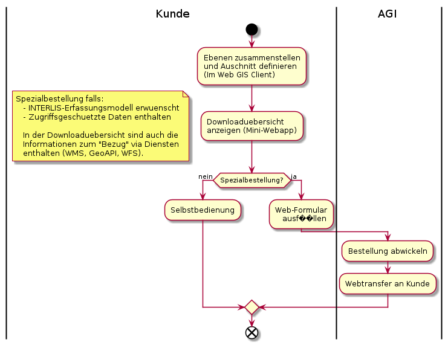

# Ablauf der Metadatenerfassung

## Bisheriger Ablauf

## Neuer Ablauf

## Ablaufanpassungen des bisherigen auf den neuen Ablauf
* Schemaerstellung wird durch Modellerstellung abgelöst
* Beidseitiges Vieraugenprinzip:
  * Fachamt prüft, ob das technische Setup korrekt ist - Sprich ob eine Kartenebene grundsätzlich geladen wird
  * AGI prüft, ob die vom Fachamt gesetzte Darstellung, Bezeichnungen, Beschreibungen den Richtlinien entspricht
* AGI gibt die Publikation auf allen "Kanälen" frei. Wenn nicht anders definiert werden die Daten sowohl für den 
Bezug in Rohdatenform (Datenabgabe, Dataservice, WFS) wie auch für den Bezug in Kartenform (WMS, WGC, QGIS Desktop) freigegeben.

# Ablauf Datendownload

* Spezialbestellung liegt vor, falls das INTERLIS-Erfassungsmodell erwünscht ist, 
oder zugriffsgeschüetzte Daten enthalten sind.
* In der Downloadübersicht sind auch die Informationen zum "Bezug" via Diensten
enthalten (WMS, GeoAPI, WFS).

## Alternativen für den Kunden

Aufgrund der "Bestückung" von geocat und oder der Integration in opendata.swiss stehen dem
Kunden "automatisch" die Such / Katalogfunktionen dieser beiden Applikationen ebenfalls zur Verfügung.