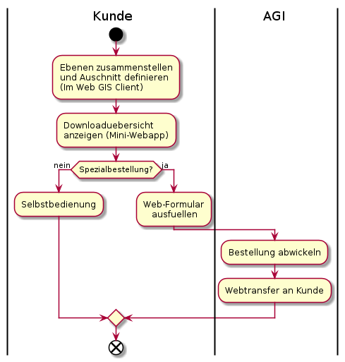

# Ablauf der Metadatenerfassung

## Bisheriger Ablauf

## Neuer Ablauf

## Ablaufanpassungen des bisherigen auf den neuen Ablauf
* Schemaerstellung wird durch Modellerstellung abgelöst
* Beidseitiges Vieraugenprinzip:
  * Fachamt prüft, ob das technische Setup korrekt ist - Sprich ob eine Kartenebene grundsätzlich geladen wird
  * AGI prüft, ob die vom Fachamt gesetzte Darstellung, Bezeichnungen, Beschreibungen den Richtlinien entspricht
* AGI gibt die Publikation auf allen "Kanälen" frei. Wenn nicht anders definiert werden die Daten sowohl für den 
Bezug in Rohdatenform (Datenabgabe, Dataservice, WFS) wie auch für den Bezug in Kartenform (WMS, WGC, QGIS Desktop) freigegeben.

## Wo ist der Master der Attributbeschreibung?

**In der Meta-DB.** 

* Die initiale Beschreibung wird aus dem Modell ausgelesen. 
* Weitere Anpassungen / Verfeinerungen werden direkt in der Meta-DB gemacht.
* Die Anpassung der Beschreibung löst darum **keine** Modelländerung aus.
* Bei einer aus anderen Beweggründen ausgelösten Modelländerung wird die Attributbeschreibung im Modell wo nötig aktualisiert.

# Ablauf Datendownload

Spezialbestellungen:
* Zugriffsgeschützte (falls Anzahlmässig wenige)
* Datenherr will wissen, wozu die Daten verwendet werden 

In der Downloadübersicht sind auch die Informationen zum "Bezug" via Diensten
enthalten (WMS, GeoAPI, WFS).

## Alternativen für den Kunden

Aufgrund der "Bestückung" von geocat und oder der Integration in opendata.swiss stehen dem
Kunden "automatisch" die Such / Katalogfunktionen dieser beiden Applikationen ebenfalls zur Verfügung.

## Anforderungen

|ID|Muss|Stichwort|Beschreibung|
|---|---|---|---|
| |Ja|Protokolle|Die Daten müssen via HTTP und FTP bereitgestellt werden|
| |Ja|Packetierung|Das Publikationmodell ist der kleinste thematische Umfang eines Downloads. Formate, welche dies nicht leisten können, werden als zip ausgeliefert (Bsp. dxf)|
| |Ja|Formate|Angeboten werden Geopackage, INTERLIS2 für Vektordaten und GeoTif für Rasterdaten. Für die Vermessungsdaten zusätzlich "dxf Geobau".|
| |Nein|Formate|Angeboten werden zusätzlich dxf und shapefile|
| |Ja|Ausdehnung|Die Ausdehnung des Angebotes richtet sich einzig nach der Nachführung und/oder der Datenmenge des entsprechenden Themas (Modelles).|
| |Ja|Benutzer-Oberflächen|Der Kunde bedient sich selbst. Ihm stehen eine kartenzentrische und eine textorientierte Benutzer-Oberfläche zur Verfügung. In der textorientierten Oberfläche sucht er sich "google-like" die Themen zusammen.|
| |Ja|Datenausschnitt|Es stehen keine kundendefinierten Ausschnitte zur Verfügung. Der Datenumfang der Downloads ist vordefiniert und statisch.|

## Todo
* Anhand der heutigen Meta-DB und der Bestellungen das Mengengerüst der Spezialbestellungen aufgrund Zugriffsschutz verstehen.
* Anforderungen verstehen, aus welchem der heute etablierte Freigabeprozess folgt.
* Raster / Lidardaten verstehen
* Implementierung für die Zugriffsgeschützten vertiefen. Idee "Modellerweiterung" klemmt wegen den Datendiensten.
    * Dienste ausklammern?
    * MetaDb weiss neu, welches Modell welchen Klassenumfang hat. MetaDb weiss schon jetzt, welche Attribute einer Klasse
    freigeschaltet sind. Damit kann ermittelt werden, ob ein Modell zugriffsgeschützte Informationen umfasst.
        * Folglich: Zugriffsgeschütztes Modell ist Spezialbestellung? --> Mengengerüst abschätzen! 
* Ueberzeugen, dass kartenzentrisch ausreicht. Wer will Geodaten bestellen, kann aber nicht mit Karten...?

    
