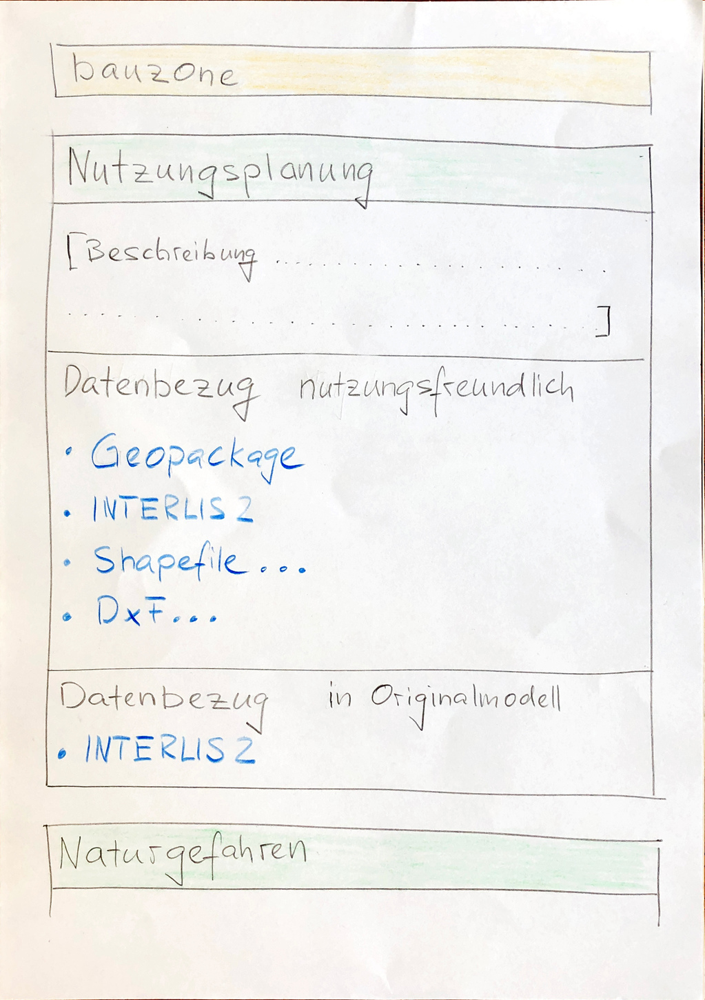
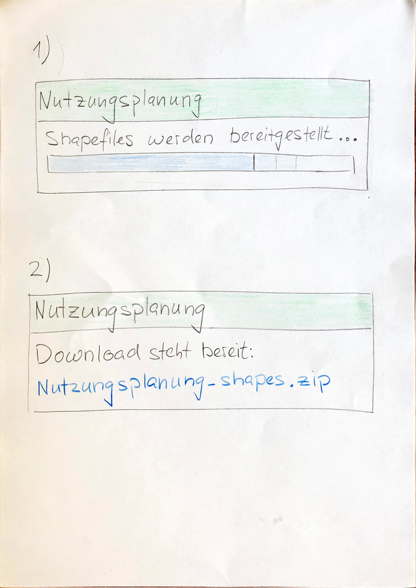

# Datenbezug

## Benutzergruppen

Der Datenbezug wird von Kunden mit unterschiedlich gelagerten Zielen und beruflichem Hintergrund genutzt. Folgend
werden die Benutzergruppen beschrieben, für welche der Datenbezug in unterschiedlicher Ausprägung bereitgestellt wird.

|Benutzergruppe|Beschreibung|Bezug
|---|---|---|
|Geo- / Planungsbüro|GIS ist eher "mittel zum Zweck" als ein alltägliches Arbeitsmittel.|Web GIS Client / Downloadliste. Geopackage oder Shapefile|
|Architekturbüro|Arbeitet typischerweise in einem CAD. Gängige Austauschformate sind DxF und Shapefile|Web GIS Client / Downloadliste. DxF oder Shapefile|
|Datenverarbeiter|Verarbeitet Daten typischerweise über mehrere Schritte und automatisiert. Wünscht sich direktesten Datenbezug. Je nach Anwendungsfall auch interessiert an den relational strukturierten Daten im Originalmodell|INTERLIS2 oder Geopackage via HTTP (FTP)|

Sowohl im Kanton wie kantonsextern sind diese Benutzergruppen vorhanden. Eine Unterscheidung in den Bezug kantonsintern / kantonsextern ist also nicht notwendig.

## Applikationen für den Datenbezug

Für den Datenbezug kommen mehrere, vom AGI bereitgestellte, respektive beim Benutzer vorhandene Applikationen zum Einsatz. 
Damit wird sichergestellt, dass die verschieden gelagerten Bedürfnisse gut abgedeckt werden.

|Applikation|Verwendung für Datenbezug|
|---|---|
|Web GIS Client|Visuelle Sichtung und Bestätigung in der Karte, dass es sich um den gewünschten Datensatz handelt. Zusammenstellung der Themen (Ebenengruppen) des Datenbezugs. Nach Abschluss der Zusammenstellung wird die Downloadliste geöffnet.|
|Downloadliste|Textuelle Bestätigung, dass es sich um den gewünschten Datensatz handelt. Auswahl von Download-Kanal und -Format.|
|HTTP- / FTP-Adresse|Stabile Adressen, mit welchen Geopackage / INTERLIS2 direkt bezogen werden kann. Dabei werden die Daten direkt vom Skript des Datenverarbeiters oder von dessen Datei-Manager "angezogen"|

Die Dienste sollen als gleichwertiges Angebot zum "klassischen" Dateibezug wahrgenommen werden. Entsprechend werden in der
Downloadliste die Bezugsmöglichkeiten via Dienst und via Datei aufgeführt.

## Downloadliste

In der Downloadliste werden für die gewählten Datensätze die Bezugsmöglichkeiten mittels Dienst und Dateibezug aufgelistet.

**Angebotene Kanäle und Formate:**
* Kanal
    * WMS
    * WFS *
* Formate für Datenbezug via HTTP / FTP
    * Geopackage
    * INTERLIS2
    * Shapefile **
    * DxF **

\* Der WFS ist aufgrund des zu komplexen Datenstandards GML ein unglücklicher Standart. Das AGI wird diesen
deshalb zeitnah mit dem neuen OGC Standard "OGC API - Features" ersetzen. Bei Problemen mit dem WFS bietet das AGI keinen
Support.

\*\* Shapefile und DxF stehen nicht vorberechnet zur Verfügung. Sie werden zur Laufzeit vom System bereitgestellt. 

### GUI-Mockup

Mittels Suchbegriffen kann die Liste der verfügbaren Downloads eingeschränkt werden ("bauzone" im Mockup). Ohne Einschränkung werden alle zum Download verfügbaren
Modellinhalte angezeigt.

Pro Thema (= pro Modell) werden die verfügbaren Datenstrukturierungen und Formate angezeigt. 

* nutzungsfreundlich (= Publikationsmodell)
    * Geopackage
    * INTERLIS2
    * Shapefile
    * DxF
* in Originalmodell (= Erfassungsmodell)
    * INTERLIS2
    

Bemerkung: Die Dienstauflistung ist im Mockup nicht visualisiert.

### Mockup der Bereitstellungs-Seite

Shapefile und DxF stehen nicht vorberechnet zum Download bereit und werden erst bei Klick auf den 
entsprechenden Link der Downloadliste erstellt.
Dem Benutzer wird während der laufenden Bereitstellung eine Seite mit Fortschrittsanzeige dargestellt 1). Anschliessend 
wird das generierte *.zip zum Download angeboten.

## "Packetierung" der Daten

### Thematische Gruppierung

Ein Abgabepacket umfasst die Daten aller Klassen (Tabellen) innerhalb des entsprechenden INTERLIS-Modelles. 
Der gesamte Modellinhalt ist also die kleinstmögliche Abgabeeinheit, nicht eine einzelne Tabelle.

### Gebietseinteilung

Meistens ist in der Datei der Datenabgabe (zum Beispiel im Geopackage) der ganze Kanton Solothurn enthalten.

Ausnahmen:
* Die Nachführung erfolgt Gebietsweise. Bereitstellung erfolgt für das Erhebungsmodell einzeln pro Nachführungsgebiet,
für das Publikationsmodell wird der ganze Kanton bereitgestellt. Dies trifft zu für
die amtliche Vermessung und Datensätze in der Zuständigkeit der Gemeinden (Nutzungsplanung, ...)
* Sehr grosse Datensätze, für welche die kantonsweite Bereitstellung zu Dateien einer Grösse über 1-2 Gb führt. 
Hintergrund: Download soll bei Downloadrate von 40 Mbit/s nicht mehr wie 5 Minuten beanspruchen. 

## Zugriffsschutz und Bezugsmöglichkeiten

Die meisten Daten des Kantons Solothurn sollen weiterhin frei und ohne Auflagen verfügbar sein (OpenData). 
Gründe, bei welchen ein Datensatz zugriffsgeschützt werden muss:
* Der Datensatz enthält personenbezogene Daten
* Eines der folgenden Kriterien trifft zu: [GeoIV Art. 22 Abs. 2](https://www.admin.ch/opc/de/classified-compilation/20071088/index.html#a22)

Die drei Zugangsberechtigungsstufen des GeoIG werden sinngemäss übernommen, und auf alle Geodaten des Kantons angewendet. 
[Zugangsberechtigungsstufen - GeoIV Art. 21](https://www.admin.ch/opc/de/classified-compilation/20071088/index.html#a21)

| |[A] - DS frei erhältlich|[B] - DS zugriffsgeschützt|[C] - DS nur auf Edit|
|---|---|---|---|
|In Meta-DB beschrieben?|Ja|Ja|Ja|
|In WGC Zusammenstellung enthalten?|Ja|Ja|Nein|
|In Downloadliste enthalten?|Ja|Ja|Nein|
|Download-Link vorhanden?|Ja|Ja - zugriffsgeschützt|Nein|
|Auf opendata.swiss gelistet?|Ja|Nein|Nein|  

Allfällige Ausnahme-Datenabgaben in der Zugriffsberechtigungsstufe C werden durch das Fachamt abgewickelt.