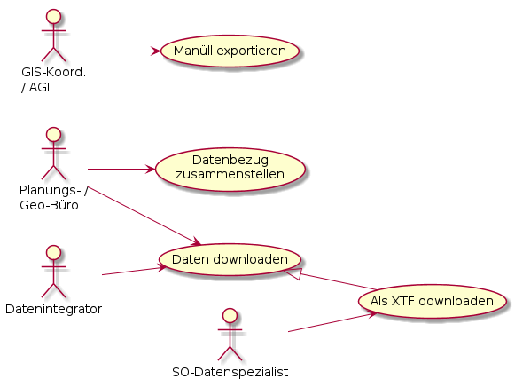

# Datenbezug

## Benutzergruppen

Der Datenbezug wird von Kunden mit unterschiedlich gelagerten Zielen und beruflichem Hintergrund genutzt. Folgend
werden die Benutzergruppen beschrieben, für welche der Datenbezug in unterschiedlicher Ausprägung bereitgestellt wird.

|Benutzergruppe|Beschreibung|Bezugskanal
|---|---|---|
|Geo- / Planungsbüro|GIS ist eher "mittel zum Zweck" als ein alltägliches Arbeitsmittel.|Web GIS Client / Downloadliste. Geopackage oder Shapefile|
|Architekturbüro|Arbeitet typischerweise in einem CAD. Gängige Austauschformate sind DxF und Shapefile|Web GIS Client / Downloadliste. DxF oder Shapefile|
|Datenverarbeiter|Verarbeitet Daten typischerweise über mehrere Schritte und automatisiert. Wünscht sich direktesten Datenbezug. Je nach Anwendungsfall auch interessiert an den relational strukturierten Daten im Originalmodell|INTERLIS2 oder Geopackage via HTTP oder FTP|

Sowohl im Kanton wie Kantonsextern sind diese Benutzergruppen vorhanden. Eine Unterscheidung in den Bezug kantonsintern / kantonsextern ist also nicht notwendig.

## Applikationen für den Datenbezug

Für den Datenbezug kommen mehrere vom AGI bereitgestellte respektive beim Benutzer vorhandene Applikationen zum Einsatz, 
um den Anforderungen der Benutzergruppen gerecht zu werden.

|Applikation|Verwendung für Datenbezug|
|---|---|
|Web GIS Client|Visuelle Sichtung und Bestätigung in der Karte, dass es sich um den gewünschten Datensatz handelt. Zusammenstellung der Themen (Ebenengruppen) des Datenbezugs. Nach Abschluss der Zusammenstellung wird die Downloadliste geöffnet.|
|Downloadliste|Textuelle Bestätigung, dass es sich um den gewünschten Datensatz handelt. Auswahl des Download-Formates.|
|HTTP- / FTP-Adresse|Stabile Adressen, mit welchen Geopackage / INTERLIS2 direkt bezogen werden kann. Dabei werden die Daten direkt vom Skript des Datenverarbeiters oder von dessen Datei-Manager "angezogen"|

## GUI-Mockup der Downloadliste

Mittels Suchbegriffen kann die Liste der verfügbaren Downloads eingeschränkt werden ("bauzone" im Mockup). Ohne Einschränkung werden alle zum Download verfügbaren
Modellinhalte angezeigt.

Pro Thema (= pro Modell) werden die verfügbaren Datenstrukturierungen und Formate angezeigt.

Datenstrukturierungen:
* nutzungsfreundlich (= Publikationsmodell)
* in Originalmodell (= Erfassungsmodell)

Formate:
* Vorberechnet
    * INTERLIS2
    * Geopackage (Nur für die nutzungsfreundliche Datenstrukturierung)
* "Klick"-Bereitstellung
    * Shapefile
    * DxF
    

### Bereitstellungs-Seite

Shapefile und DxF stehen nicht vorberechnet zum Download bereit und werden erst bei Klick auf den entsprechenden Link erstellt.
Dem Benutzer wird während der laufenden Bereitstellung eine Seite mit Fortschrittsanzeige dargestellt 1). Anschliessend 
wird das generierte *.zip zum Download angeboten.

## $td Bogen spannen zu Spezialbestellungen, abschliessen

## Datensatzkategorien und Bezugsmöglichkeiten

| |DS frei erhältlich|DS zugriffsgeschützt|DS nur auf Edit|
|---|---|---|---|
|In Meta-DB beschrieben?|Ja|Ja|Ja|
|In WGC Zusammenstellung enthalten?|Ja|Ja|Nein|
|In geocat enthalten?|Ja|Ja|Nein|
|Download-Link vorhanden?|Ja|Ja - zugriffsgeschützt|Nein|
|Auf opendata.swiss gelistet?|Ja|Nein|Nein|  

## Anwendungsfälle

|Anwendungsfall|Beschreibung|
|---|---|
|Spezialbestellung manuell exportieren||
|Spezialbestellung manuell exportieren||
|Spezialbestellung manuell exportieren||
|Spezialbestellung manuell exportieren||

### Alternativen für den Kunden

Aufgrund der "Bestückung" von geocat und oder der Integration in opendata.swiss stehen dem
Kunden "automatisch" die Such / Katalogfunktionen dieser beiden Applikationen ebenfalls zur Verfügung.

## Ablauf "Datenbezug zusammenstellen"

Spezialbestellungen:
* Zugriffsgeschützte (falls Anzahlmässig wenige)
* Datenherr will wissen, wozu die Daten verwendet werden 

In der Downloadübersicht sind auch die Informationen zum "Bezug" via Diensten
enthalten (WMS, GeoAPI, WFS).

## Anforderungen

|ID|Muss|Stichwort|Beschreibung|
|---|---|---|---|
| |Ja|Protokolle|Die Daten müssen via HTTP und FTP bereitgestellt werden|
| |Ja|Packetierung|Das Publikationmodell ist der kleinste thematische Umfang eines Downloads. Formate, welche dies nicht leisten können, werden als zip ausgeliefert (Bsp. dxf)|
| |Ja|Formate|Angeboten werden Geopackage, INTERLIS2 für Vektordaten und GeoTif für Rasterdaten. Für die Vermessungsdaten zusätzlich "dxf Geobau".|
| |Nein|Formate|Angeboten werden zusätzlich dxf und shapefile|
| |Ja|Ausdehnung|Die Ausdehnung des Angebotes richtet sich einzig nach der Nachführung und/oder der Datenmenge des entsprechenden Themas (Modelles).|
| |Ja|Benutzer-Oberflächen|Der Kunde bedient sich selbst. Ihm stehen eine kartenzentrische und eine textorientierte Benutzer-Oberfläche zur Verfügung. In der textorientierten Oberfläche sucht er sich "google-like" die Themen zusammen.|
| |Ja|Datenausschnitt|Es stehen keine kundendefinierten Ausschnitte zur Verfügung. Der Datenumfang der Downloads ist vordefiniert und statisch.|
| |Ja|Änderungsart|Der Datenbezugsdienst gibt Auskunft über die Art der Aktualisierung (manuell, periodisch), bei periodisch über das Aktualisierungs-Intervall (wöchentlich, ...) den Zeitpunkt der letzten Aktualisierung  

## Todo
* Anhand der heutigen Meta-DB und der Bestellungen das Mengengerüst der Spezialbestellungen aufgrund Zugriffsschutz verstehen.
* Anforderungen verstehen, aus welchem der heute etablierte Freigabeprozess folgt.
* Raster / Lidardaten verstehen
* Implementierung für die Zugriffsgeschützten vertiefen. Idee "Modellerweiterung" klemmt wegen den Datendiensten.
    * Dienste ausklammern?
    * MetaDb weiss neu, welches Modell welchen Klassenumfang hat. MetaDb weiss schon jetzt, welche Attribute einer Klasse
    freigeschaltet sind. Damit kann ermittelt werden, ob ein Modell zugriffsgeschützte Informationen umfasst.
        * Folglich: Zugriffsgeschütztes Modell ist Spezialbestellung? --> Mengengerüst abschätzen! 
* Ueberzeugen, dass kartenzentrisch ausreicht. Wer will Geodaten bestellen, kann aber nicht mit Karten...?
* In der WGC-Zusammenstellung wird ein geschützter DS gar nicht gefunden, wenn man sich nicht vorgängig im WGC angemeldet hat.

Ergänzen:
* Gründe für die Spezialbestellungen.
    * Gründe mit Delegation an AGI
    * Gründe ohne Delegation an AGI --> GIS-Koordinator muss es machen.
* Spezialbestellung --> GIS-Koordinator manuell in QGIS.
* Matrix bezüglich Datenbereitstellungsart und Schutzbedarf des Datensatzes.

Besprochenes einarbeiten:
* Vorberechnete Bereitstellung als xtf (Edit und Prod) und als Geopackage (nur Prod). 
* On-Demand Konvertierung in Shapefile und DXF 
* Vermessung wird zusätzlich auch als DXF Geobau bereitgestellt (Vorberechnet)
* Wichtig ist ein GUI, in welchem mittels guter Suche das Angebot ausschliesslich des Kanton Solothurn durchsucht werden kann.
    * Geocat leistet dies heute schon (fast), mit einer guten Suche, eingeschränkt auf den Kanton XY

    
