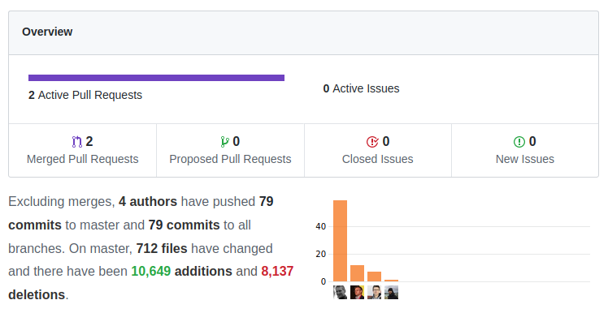
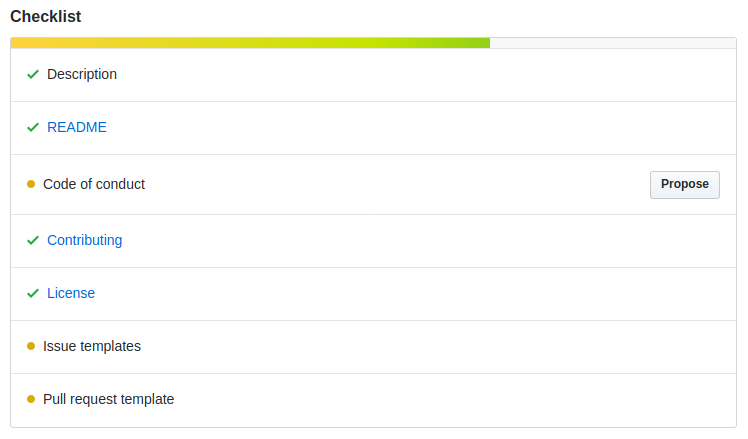
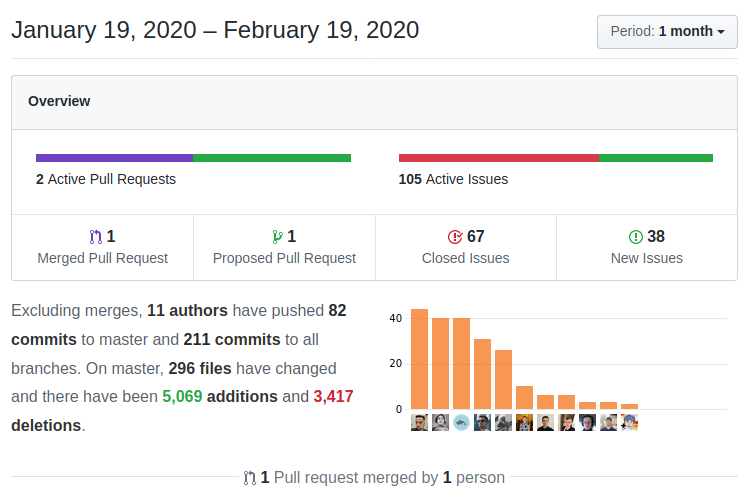
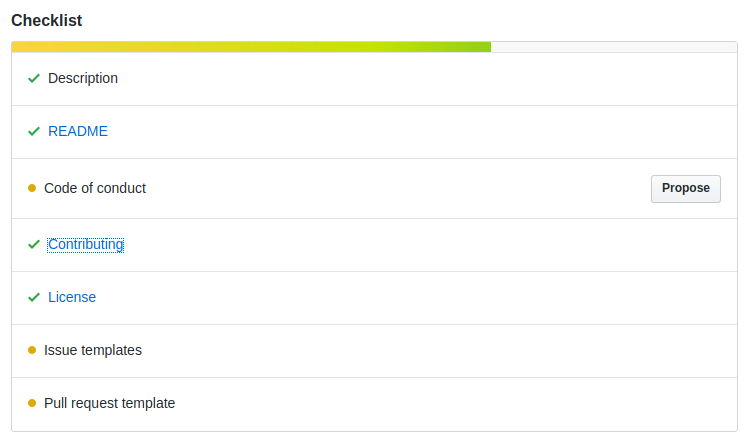
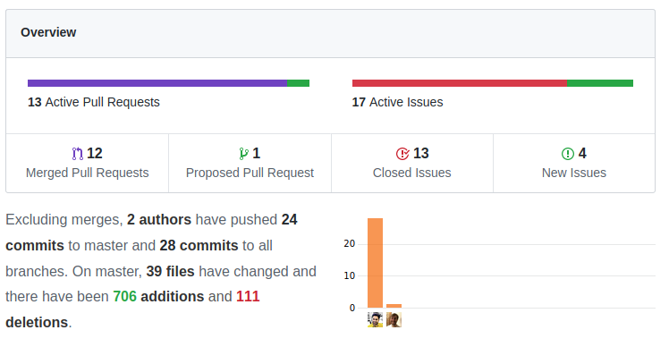
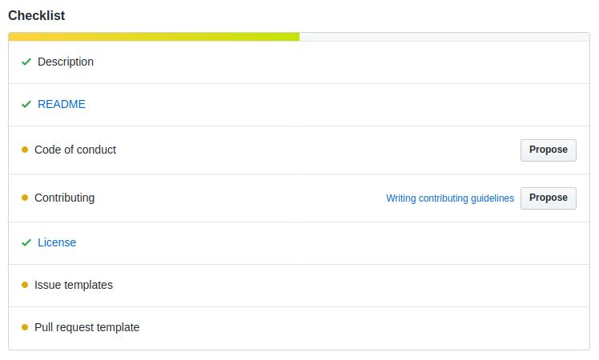
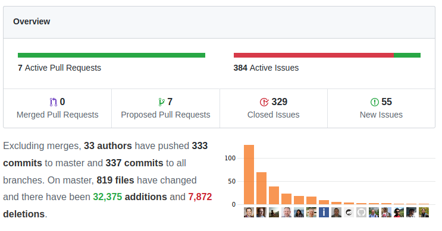
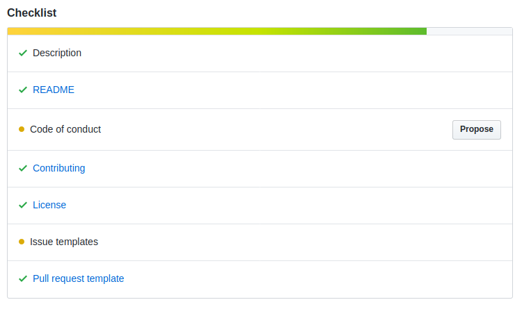

# Evaluation der drei Frameworks in der engeren Auswahl

Die Evaulation setzt sich zusammen aus einer theoretischen und einer praktischen Prüfung.
* Nach der theoretischen Prüfung sollen noch ein bis zwei Frameworks übrig bleiben
* Die "übrig bleibenden" werden mit je einem Prototyp auch "hands on" auf ihre Tauglichkeit geprüft.

## Theoretische Prüfung

Diese richtet sich nach wichtigen und gleichzeitig einfach aus github / der Frameworkdokumentation zu eruierenden Kriterien.

|Framework > | Apache Isis | Cuba platform | Grails | Spring Boot |
| --- | --- | --- | --- | --- |
|Kriterien: |||||
|Aktive core commiter: |2|5-6|0-1|4|
|Prof. Support: |Nein|Ja - Haulmont|Ja - OCI|Ja - Pivotal|
|Dokumentation:  - Getting Started  - Validierung  - Vererbung  - Beziehungen |2.5 - fast nichts zu Vererbungen und Beziehungen|4|4|Nicht vergleichbar|
|Validierung: |gut|sehr gut|sehr gut|sehr gut|

Bewertung:
* Der Dokumentation: Konnten zu den vier Themen genügende Informationen in der offiziellen Dokumentation gefunden werden?
* Der Validierung: Sehr gut, wenn deklarativ und funktional validiert werden kann und aus der Doku verständlich hervorgeht, wie das gemacht werden muss. Sonst gut oder soso

### Fazit der theoretischen Prüfung

Am Besten schneidet die **cuba platform** ab. 

Für den Entscheid des zweiten Platzes muss abgewogen werden zwischen:
* Anzahl core committer - spricht für ISIS
* Professioneller Support, Doku, Validierung: Spricht für Grails

### Details aus Github Pulse (Abgerufen am 19. Feb. 2020)

#### Apache Isis

#### Cuba platform

#### Grails

### Spring boot (Vergleichsgrösse)

## Praktische Evaluation

Siehe 