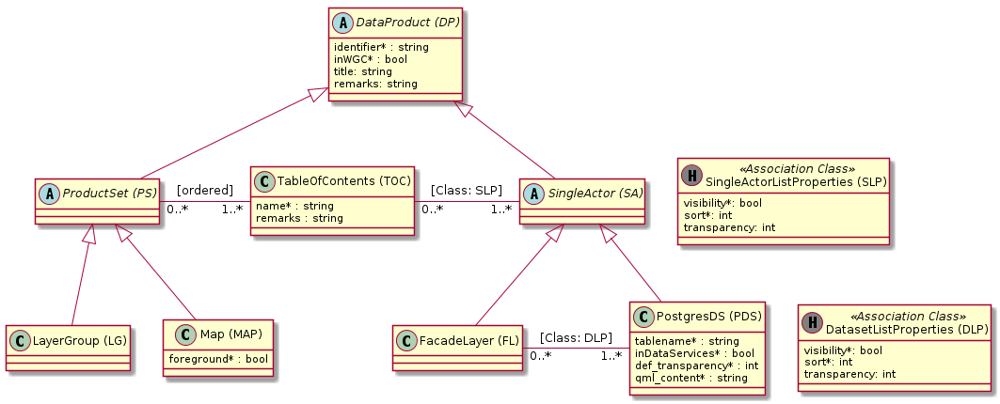

# Prototypes

## Goals for the protoypes:

Feel how the work is accomplished with the frameworks.

Get "hands-on" experience on some (in our eyes) crucial functionalities of the framework:
1. Design "fitting" UI's featuring high usability by writing only few lines of code (loc)
1. "Good" UI-Components
1. Freedom to create intuitive distribution of the components on the screen
1. Well placed validation feedback. Writing the rules with few loc
1. Good "end to end" ORM solution (inheritance and associations). With trying out different inheritance mappings "down" to the db.
1. Traceability of last change to an entity
1. Setting permissions to screens
1. Migrating the data-model "in production"
   
Additionally, document valid ways to integrate "Non-CRUD" functionalities into the UI:
1. Upload and strip xml file via custom code. Store stripped xml in entity field (non binary).
1. Integrate postgres metadata catalogue queries and store results in entity fields.
1. For a small part of the data model - the master data resides in another application. Create a data service interface that will be used by the other application to keep copies of the master data up to data in the "cuba db".
1. Create a screen or report showing all dependent configurations for a geodata table.
    
## Data model

The used data model is a stripped and compressed subset of the origin models "map" and "data". 
See  concerning the documentation of the origin models (in german).

### Model V1

### Model V2

Changes since V1:
* New entity DataSetList (DSL)
* New mandatory field "qml_content" on PostgresDS. With "select file from disc" functionality.
* Moves the identifier field from SA and PS up to DP

 

