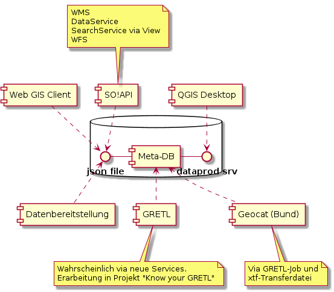

# Verwendung von Metainformationen in der GDI-SO

## Begriffsdefinition "Metainformationen"

Mit Metainformationen sind immer 
* sowohl konfigurative Metainformationen wie beispielsweise ein QML
* wie auch die "klassischen" beschreibenden Metadaten für den Menschen

## Verwendungen

