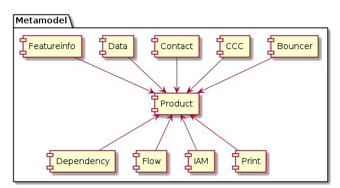

# Packages (Teilmodelle)



* **Core** Enthält die Kernklassen für die Gruppierung und Konfiguration 
von Datenprodukten (Datasets, Productsets, ...). [[Link]](core.md)
* **Data** Enthält die Klassen für die Beschreibung der von der GDI genutzten 
Datenquellen (GIS-Tabellen, Raster, ...). [[Link]](data.md)
* **IAM** Klassen zur Konfiguration des Identity und 
Access Management (Benutzer, Gruppen, Rollen, ...). [[Link]](iam.md)
* **Contact** Teilmodell zur Definition der Kontaktinformationen 
bezüglich der genutzten Daten. [[Link]](contact.md)
* **Flow** Modelliert die Informationsflüsse zwecks Übersicht der notwendigen Anpassungen bei
Schemaänderungen etc. [[Link]](flow.md)
* **CCC** Modelliert die einzelnen CCC-Integrationen (CCC-Client)[[Link]](ccc.md)
* **Bouncer** Klassen zur Konfiguration des Bouncer-Proxy, 
welcher den Zugriff auf eine Ressource (Report, ...) einschränkt. [[Link]](bouncer.md)
* **Print** Modelliert die Metainformationen für das Erzeugen von Karten-PDF's [[Link]](print.md)
* **Dependency** Liste der Komponenten, welche von Kern-Artefakten der GDI abhängig sind [[Link]](dependency.md)

## Erläuterungen zur Kapitelstruktur innerhalb der Teilmodelle

Strukturierung der *.md der Teilmodelle:
 
```
# [Name des Teilmodelles] --Erläuterungen zum ganzen Teilmodell
## Modell-Konstraints -- Falls zutreffend
## Klasse [Klassenname] -- Erläuterungen zu einer Klasse des Teilmodelles
### Attributbeschreibung -- Tabellarische Beschreibung der Attribute
### Konstraints -- Falls zutreffend
```

In den Modell-Konstraints werden auch *:* Beziehungen genauer spezifiziert, sofern dafür ein applikatorischer Konstraint
sinnvoll ist.

### Spalten der Attributbeschreibung

* **Name:** Attributname
* **Typ:** Java-Datentyp des Attributes. String wird zusätzlich mit der Länge qualifiziert.
* **Z** Ist das Attribut **z**wingend erforderlich? (j,n)
* **Beschreibung** Erläuterungen zum Attribut

```markdown
|Name|Typ|Z|Beschreibung|
```

# Modellierungsfragen

|Betrifft|Frage|Wer|
|---|---|---|
|data.PostgresSchema|Wann sind die verwendeten Parameter der Schemaerstellung mittels ili2pg Teil des Model-Repos?|Stefan|
|-|Ist nicht nötig. Die Parameter werden in die ili2db Metatabellen im Schema selbst geschrieben.|-|
|data.PostgresDB|Verwendung der Service-Definition verstehen. Host und Port als Attribute ok?|Michael|
|-|Antwort...|-|
|data und core|Transparenz-Regeln verstehen.|Michael|
|-|Antwort...|-|
|data|Externe WMS-Ebene wie einbinden? Vergleichen mit aktualisiertern Config-DB|Oliver|
|-|Antwort...|-|
|data|Wie die Raster in die GDI einbinden? Es gibt zu viele Möglichkeiten...|Stefan|
|-|Antwort...|-|
|Dependencies|Erfassen wir auch reine Identifier-Abhängigkeiten? Wie die Abhängigkeit auf den Namen einer WMS-Ebene?|Michael und Stefan|
|-|Antwort...|-|
|Konf Backgroundlayer|Soll das weiterhin erfasst werden? Eine flexiblere Konfigurationsvariante ist die Bereitstellung einer Rumpf-Konfiguration des config.json des Web GIS Client. In diese werden die dynamischeren Eigenschaften von beispielsweise den Vordergrundebenen hineingeneriert.|Michael und Stefan|
|-|Antwort...|-|
|GM03|Modellierung der Klassen und Beziehungen für GM03|Peter|
|-|Antwort...|-|
|GM03|Verifikation, dass Contacts-Modellierung GM03-Kompatibel ist|Peter|
|-|Antwort...|-|
|core.DataProduct.identifier|Namenskonvention einführen? ch.so.xy.[Thema].(edit.)[Layername](_data). Thema entspricht Modellname ohne Version.|Stefan|
|-|Antwort...|-|

```
|Betrifft|Frage|Wer|
|-|Antwort...|-|
```

```
# [Name des Teilmodelles] --Erläuterungen zum ganzen Teilmodell
## Modell-Konstraints -- Falls zutreffend
## Klasse [Klassenname] -- Erläuterungen zu einer Klasse des Teilmodelles
### Attributbeschreibung -- Tabellarische Beschreibung der Attribute
### Konstraints -- Falls zutreffend

|Name|Typ|Z|Beschreibung|
```


