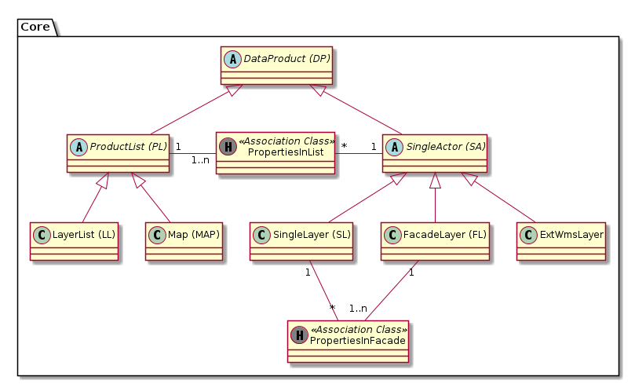

# Core

## Klassenbeschreibung

### DataProduct (DP)

Basisklasse aller Datenprodukte. Synonyme bei räumlichen Daten ist die Datenebene (der Layer).

Beispiel tabellarische Daten: Wenn ein DataProduct genau eine Tabelle umfasst ist es ein Objekt
der Subklasse DataSet, wenn es mehrere Tabellen umfasst ein Objekt der Subklasse Productset respektive FacadeLayer.

Der Dateninhalt von externen Diensten wird nach Bedarf ebenfalls als DataProduct geführt.
Beispiele:
* WMS-Ebene eines Nachbarkantones welcher in eine vorkonfigurierte Karte des Kantons Solothurn aufgenommen wird.
* WMS-Ebene der Fachapplikation Altlast4Web welche in eine thematische Karte des SO!Map-Clients eingebunden werden soll.

**Unique-Bedingung:** Feld "identifier" ist GDI-weit eindeutig

### FacadeLayer (FL)
Aggregationslayer, welcher von den Applikationen als ein Layer angesprochen wird.

Layereigenschaften wie Sichtbarkeit und Transparenz wirken sich nur auf den FacadeLayer als ganzes aus und nicht 
individuell auf die im Facadelayer enthaltenen Unterlayer. Die enthaltenen Unterlayer sind im TOC nicht sichtbar.

Beispiel: Plan für das Grundbuch

Im GUI steht eine Funktion zur Verfügung, um automatisiert eineb FacadeLayer in eine LayerList umzuwandeln.

### LayerList (LL)

Sortierte Liste von Einzellayern (=SingleActor), welche im Webclient „explodiert“ dargestellt wird.

Im GUI steht eine Funktion zur Verfügung, um automatisiert eine LayerList in einen FacadeLayer umzuwandeln. 

### SingleActor (SA)

Einzelebene oder FacadeLayer. Verhält sich in den Clients immer wie eine einzelne Ebene. Die Kindebenen eines FacadeLayer
erscheinen beispielsweise nicht als WMS-Ebene und werden in der TOC des Web GIS Client nicht angezeigt.

### SingleActorLinkProperties (SAL)

Attributierte Verknüpfungstabelle der m:n Beziehung zwischen TOC und SA

### SingleLayer (SL)

Einzelebene, welche die Daten aus 
* einer Postgres-Tabelle mit oder ohne Geometrie
* einem Geotif
* ...
bezieht.

### SingleLayerLinkProperties (SLL)

Attributierte Verknüpfungstabelle der m:n Beziehung zwischen FL und SL

### ProductList (PL)

Sortierte Zusammenstellung aus SingleActor-Instanzen.

Beispiele: 
* Sortierte Liste von Einzeldatensatzdarstellungen (=DataSet), die gemeinsam als eine WMS „Gruppenebene“ dargestellt wird.
* Sortierte Liste mehrerer TOC's als Inhalt einer Karte (=Map).

### TableOfContents (TOC)

Ist ein "Konfigurations-Baustein", welcher via Layergruppe und Map mehrfach genutzt werden kann. Der Inhalt einer DSL
muss einen engen thematischen Kontext haben (Im Gegensatz zur Map).

**Unique-Bedingung:** Feld "name" ist eindeutig

## Beispielkonfigurationen und resultierende Einträge in PL - TOC - SA:

* Einzel publiziertes DS: Kein Eintrag in TOC
* Einzel publizierter FL: Kein Eintrag in TOC
* LL mit FL und DS: Ein Eintrag in TOC. Je ein Eintrag fuer FL und DS in der SAL   
* Vordergrund-Karte (Map) mit LL1 und FL2: 
  * Je ein Eintrag in TOC fuer LL1 und FL2.
  * FL2 hat einen, LL1 mehrere Eintraege in der TOC.
* Hintergrund-Karte (Map) mit FL3 und FL4.
  * Je ein Eintrag in TOC fuer FL3 und FL4.
  * FL3 und FL4 haben je einen Eintrag in der TOC.