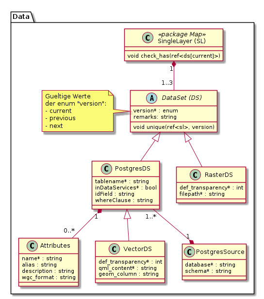

# Data

Stellt die Klassen des Datenkonfigurationsteils dar
* Tabellarische Daten aus Postgres/PostGIS mit und ohne Geometrie
* Rasterdaten aus einem File / einem Katalog
* Rasterlayer aus einem externen WMS

## Übergeordnete Klassen

### Klasse DataTheme

DataTheme ist der enge fachlich-thematische Kontext, über den sich die Struktur des Datenbezuges definiert.

#### Attributbeschreibung

|Name|Typ|Z|Beschreibung|
|---|---|---|---|
|name|String(100)|j|Sprechende Bezeichnung des Themas.|
|remarks|String|n|Interne Bemerkungen zum DT.|

#### Gebietseinteilung für Datenbezug

Sofern das DataTheme über eine Gebietseinteilung verfügt, wird dies über die Beziehung DT - TableView und die 
folgenden Attribute dokumentiert und gesteuert:

|Name|Typ|Z|Beschreibung|
|---|---|---|---|
|part_url_attributes|String(200)|Json-Array der Attribute für die URL (Attribut part_url_pattern).|
|part_url_pattern|String(200)|n|Pattern, welches die Download-URL eines Teilstückes des DS bestimmt.|
|part_display_attributes|String(200)|Json-Array der Attribute für die Darstellung des Gebietes (Attribut part_display_pattern).|
|part_display_pattern|String(200)|n|Pattern, welches den Display-String eines Teilstückes des DS bestimmt.|

Beispiele für die Patterns (Java MessageFormat):
* Vektordatensatz (AV):
    * Foreign Key auf TableView: `agi_hoheitsgrenzen_pub.hoheitsgrenzen_gemeindegrenze [DEFAULT]`
    * part_url_attributes: `["bfs_gemeindenummer"]`
    * part_url_pattern: `https://geo.so.ch/api/rawdata/av/{0}`
    * part_display_attributes: `["gemeindename"]`
    * part_display_pattern: `AV-Daten der Gemeinde: {0}`
* Oberflächenmodell (LIDAR):
    * Foreign Key auf TableView: `agi_lidar_pub.lidarprodukte_lidarprodukt [DOM]`
    * part_url_attributes: `["x_min","y_min"]`
    * part_url_pattern: `https://geo.so.ch/api/rawdata/lidar_dom/{0}/{1}`
    * part_display_attributes: `["x_min","y_min"]`
    * part_display_pattern: `Kachel {0} / {1} (X Min / Y Min)`

### Klasse DataSet

Bei Vektor- oder tabellarischen Daten entspricht ein Dataset-Eintrag einer (Geo-) Tabelle. 
Bei Rasterdaten entspricht es einem Rasterlayer (Es werden keine nicht georeferenzierten Bilder erfasst).

Bemerkung zur Vererbungs-Strategie: Es ist OK, wenn die DS-Typen (TableDS, RasterDS) nicht in einer physischen
Tabelle "DataSet" zusammengefasst werden.

#### Attributbeschreibung

|Name|Typ|Z|Beschreibung|
|---|---|---|---|
|remarks|String|n|Interne Bemerkungen zum DS.|

### Klasse DataSetView

Direkt aus einem Dataset abgeleitetes Produkt, welches Eigenschaften 
(Darstellung / Attribute) eines Dataset auf den entsprechenden Einsatzzweck anpasst.

Keine Rendering-Information hat ein DSV vom Typ "externe WMS Ebene". Bei internen Raster- und Tabellarischen
Daten ist das Styling als QML optional enthalten.

#### Attributbeschreibung

|Name|Typ|Z|Beschreibung|
|---|---|---|---|
|name|String(100)|j|Interne Bezeichnung der DataSetView, um diese von weiteren DSV's des gleichen DS unterscheiden zu können. Wird nur manuell gesetzt falls defaultView=false.|
|defaultView|boolean|j|Für ca. 3/4 der DS gibt es "nur" die Default-View. Bei defaultView=true setzt SIMI [name] auf "default". Default: true.|
|remarks|String|n|Interne Bemerkungen zur DSV.|
|styleServer|byte[]|n|QML-Datei, welche das Styling der Ebene in QGIS-Server bestimmt.|
|styleClient|byte[]|n|QML-Datei, welche das Styling der Ebene in QGIS-Desktop bestimmt. Falls null und style_server <> null wird style_server verwendet.|

#### Konstraints

UK auf den FK zum SingleLayer.

### Beziehung SingleLayer - DataSetView

Die 1 : 0..1 Beziehung existiert im Datenmodell bewusst. Motivationen:
* Schlanke "Schnittstelle" zwischen den Teilmodellen Core und Data.
* Technisch: Möglichkeit, die Vererbungsstrategien für Dataproduct und Kinder in Core anders zu wählen wie für DSV und Kinder in Data.
* "Poor-Man-Versioning": Es besteht die Möglichkeit, temporär mehrere DSV mit oder ohne verdoppelten DS zu halten. Beispielablauf:
    * Kopie des sich ändernden DS mit seinen DSV's erstellen (Zeigen beispielsweise auf neue Modellversion).
    * Rollout 1: Original-DSV's haben weiterhin die Referenz auf den SingleLayer --> Diese werden deployt, und nicht die veränderten Kopien.
    * Änderungen auf den Kopien sind fertiggestellt --> Kopien erhalten die Referenz auf die entsprechenden SingleLayer, und sind damit für den Rollout "scharf".
    * Rollout 2: Kopien werden deployt.
    
Je nach Risikoeinschätzung werden vor oder nach dem Rollout 2 die Originale gelöscht. Solange die Originale noch vorhanden sind, 
ist ein relativ einfaches "rollback" zu machen.

## Klassen in Teilmodell "tabular"

### Klasse TableView

Aus einer Datenbank-Tabelle oder -View abgeleitete "Soft View" mit Filtermöglichkeit sowohl auf die angebotenen
Spalten (via AttributeList) wie auch auf die angebotenen Zeilen (mittels Where-Clause).

#### Attributbeschreibung

|Name|Typ|Z|Beschreibung|
|---|---|---|---|
|whereClause|String(200)|n|Where-Clause zur Einschränkung der Anzahl Zeilen in der TableView.|
|geomFieldName|String(100)|n|Bei mehreren Geometriespalten: Name der zu verwendenden Geometrie der TableView.|

### Klasse ViewField

Sortierte Liste der Attribute mit Alias einer TableView.

#### Attributbeschreibung

|Name|Typ|Z|Beschreibung|
|---|---|---|---|
|sort|int|j|Sortierung in WMS Featureinfo und WGC.|
|alias|String(100)|n|Sprechende Bezeichnung des Attributes in WMS und WGC Featureinfo.|
|wmsFiFormat|String(100)|n|Python Formattierungs-String, welcher die Formatierung des Attributes für WMS GetFeatureInfo steuert.|
|displayProps4Json|Json|n|Definiert Alias, Reihenfolge, Wertformatierung für die Properties eines Json-Feldes.|

#### Konstraints

UK über FK's. 

#### Bemerkungen

"wmsFiFormat" und "displayProps4Json" sind nur aktiv, wenn für die Ebene keine separate FeatureInfo-Konfiguration
 erstellt wurde (Teilmodell Featureinfo).
 
### Klasse TableDS

Tabelle einer Datenbank der GDI oder mit Bezug zur GDI

#### Attributbeschreibung

|Name|Typ|Z|Beschreibung|
|---|---|---|---|
|tableName|String(100)|j|Name der Tabelle oder View in der Datenbank|

#### Konstraints

Es wird explizit **kein** Konstraint auf tableName gesetzt, um das Arbeiten mit Versionen zu erlauben.

### Klasse ExternalTable

Tabelle einer externen Datenbank, aus welcher die GDI liest oder schreibt (GRETL).

#### Attributbeschreibung

Keine eigenen Attribute.
 
### Klasse PostgresTable

GDI Postgres-Tabelle oder -View.

#### Attributbeschreibung

|Name|Typ|Z|Beschreibung|
|---|---|---|---|
|idFieldName|String(100)|j|Name des Attributes, mit welchem die Objekte der Tabelle eindeutig identifiziert werden.|
|rawDownload|boolean|j|Gibt an, ob die PostgresTable in der Form von AtOS, DataService, WFS bezogen werden kann. Default: Ja|
|catSyncStamp|DateTime|j|Zeitpuntk des letzten Abgleiches mit dem effektiven Schema der Geodatenbank.|
|geomFieldName|String(100)|n|Name des Geometrieattributes. Null, wenn die Tabelle keine oder mehrere Geometrien umfasst.|

### Klasse TableField

Umfasst die Eigenschaften eines Attributs einer PostgresDS. Die Geometriespalten werden nicht beschrieben.

#### Attributbeschreibung

|Name|Typ|Z|Beschreibung|
|---|---|---|---|
|name|String(100)|j|Name des Attributes in Postgres. Maximallänge in Postgres scheint 64 zu sein, darum String(100).|
|typeName|String(100)|j|Name des Datentypes des Attributes.|
|catSynced|boolean|j|Gibt an, ob das Attribut bei der letzten Katalogabfrage in der Datenbank vorhanden war.|
|nameInShape|String(7)|n|Optional von Fachamt definierbarer Name für den Shapefileexport.|
|description|String|n|Beschreibung (Metadaten) zum Attribut. Wird initial aus INTERLIS-Modell befüllt.|

#### Konstraints

UK über "name" und FK zu PostgresTable.
    
#### Bemerkungen:
* Die Namen der Attribute werden mittels Katalogabfrage aus Postgres gelesen.

### Klasse ModelSchema

Schema, welches mittels INTERLIS-Modell und ili2pg erzeugt wurde. Das Metamodell geht einer Beziehung 
Schema 1 : 0..1 Modell aus. Es kann also maximal ein "Gebrauchsmodell" pro Schema hinterlegt werden.

#### Attributbeschreibung

|Name|Typ|Z|Beschreibung|
|---|---|---|---|
|schemaName|String(100)|j|Name des Schemas.|
|modelName|String(100)|n|Name des INTERLIS-Modelles, mit welchem das Schema angelegt wurde.|

#### Konstraints

UK über schemaName, modelName und FK auf PostgresDB.

### Klasse PostgresDB

Postgres-Datenbank, in welcher das Schema (PostgresSchema) enthalten ist. Universell adressiert mittels
* Datenbankname
* Hostname des PG-Clusters
* Port des PG-Clusters

#### Attributbeschreibung

|Name|Typ|Z|Beschreibung|
|---|---|---|---|
|dbName|String(100)|j|Name der Datenbank auf dem Cluster.|
|clusterHost|String(100)|j|Hostname des Postgres-Cluster.|
|clusterPort|int|j|Port des Cluster.|

## Klassen in Teilmodell "raster"

### Klasse RasterView

Enthält die Darstellungsdefinition für ein Raster-DataSet

#### Attributbeschreibung

Keine eigenen Attribute

### Klasse RasterDS

Enthält die Informationen zu den Rohdaten eines Raster-Datensatzes (Ablagepfad etc.). 
Ausgestaltung abhängig von den Resultaten der Abklärung zur "besten" Raster-Datenhaltung für das AGI.

#### Attributbeschreibung

|Name|Typ|Z|Beschreibung|
|---|---|---|---|
|path|String(200)|j|Filepfad zur verwendeten Rasterebene.|

# Datenumfang für verschiedene Modellarten

Im Minimalszenario weiss SIMI "viel" vom Pub-Modell und -Schema eines Themas, und sehr wenig vom Edit-Modell und -Schema.
Minimalanforderungen bezüglich dem Edit-Modell und Schema:
* Ausgabe, welche Zieltabellen von der Änderung einer Quelltabelle potentiell betroffen sind (Teilmodell Flow "downstream").
* Für die Datenbereitstellung idenfifizieren, welches Edit-Modell zu einer Pub PostgresTable "gehört" (Teilmodell Flow "upstream").

## Eigenschaften Matrix

Die Matrix-Tabelle bildet die Eigenschaften von tabellarischen DS und DSV bei unterschiedlichen Modellarten ab:

|Setting ▶|DB ausserhalb GDI|Edit DB|Stageing|Pub DB|
|---|---|---|---|---|
|Eigenschaft ▼| | | | |
|Schema beschrieben?|Nein|Ja *1|Nein? *2|Ja|
|DS beschrieben?|? *3|Ja? *4|Nein|Ja|
|DS Attribute beschrieben?|Nein|Teilweise *5|Nein|Ja|
|DSV beschrieben?|Nein|Teilweise *6|Nein|Ja|
|DSV hat Attributliste?|Nein|Teilweise *7|Nein|Ja|

### Bemerkungen
* \*1: Ist wahrscheinlich notwendig für den Datenbezug
* \*2: Fraglich, ob diese in der Meta-DB interessieren? Muss dokumentiert werden, dass diese Teil des GRETL-Jobs xy sind?
* \*3: Eher ja, damit wir unsere externen Abhängigkeiten "im Griff" haben.
* \*4: Eher ja, damit wir ein vollständiges Bild unserer Daten haben. Die an einem Job teilnehmenden TableDS sind sicher beschrieben. Nicht beschrieben werden von ili2db generierte Metatabellen, Aufzählungstyp-Tabellen, ...
* \*5, \*6, \*6: Beschrieben, falls die entsprechende Tabelle im API / WGC publiziert ist.
 
 

