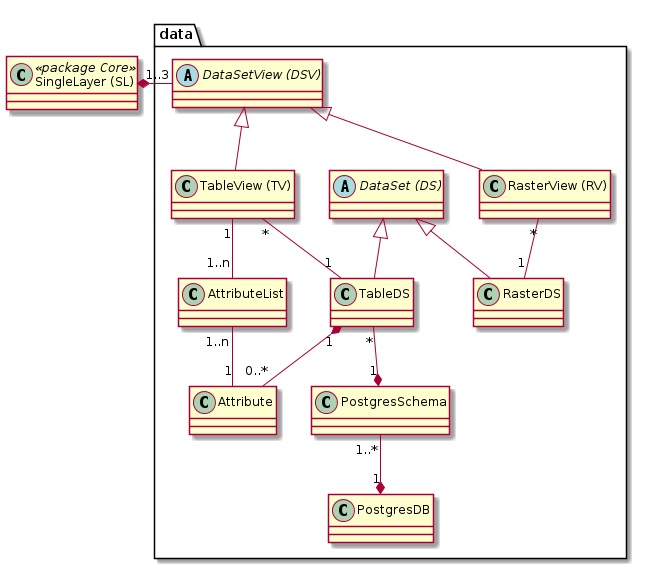

# Data

Stellt die Klassen des Datenkonfigurationsteils dar
* Tabellarische Daten aus Postgres/PostGIS mit und ohne Geometrie
* Rasterdaten aus einem File / einem Katalog

## Attribut

Umfasst die Eigenschaften eines Attributs einer PostgresDS. 

Bemerkungen:
* Die Namen der Attribute werden mittels Katalogabfrage aus Postgres gelesen.
* Zwei PostgresDS können auf dasselbe Attribut verweisen. Da dies aber nicht häufig vorkommt, wird auf eine 
Normalisierung verzichtet. Der Vorteil des einfachen Modelles überwiegt den Nachteil der punktuellen Doppelerfassung
von Beispielsweise des Feldes "description". 

**Attributbeschreibungen:**

|Name|Typ|Z|Beschreibung|
|---|---|---|---|
|name|String(100)|j|Name des Attributes in Postgres. Maximallänge in Postgres scheint 64 zu sein, darum String(100)|
|nameInShape|String(7)|n|Optional von Fachamt definierbarer Name für den Shapefileexport|
|description|String(100)|n|Beschreibung (Metadaten) zum Attribut. Wird initial aus INTERLIS-Modell befüllt|
|fiAlias|String(100)|n|Sprechende Bezeichnung des Attributes in WMS und WGC Featureinfo|
|fiSort|Integer|n|Sortierung der Attribute im WMS und WGC FeatureInfo|
|catSynced|boolean|j|Gibt an, ob das Attribut bei der letzten Katalogabfrage in der Datenbank vorhanden war.|
|catSyncStamp|DateTime|j|Gibt an, wann das letzte Mal mit dem Katalog abgeglichen wurde.|
|wmsFiFormat|String(50)|n|Python Formattierungs-String, welcher die Formatierung des Attributes für WMS GetFeatureInfo steuert.|
|wgcDisplayProps4Json|Json|n|Definiert Alias, Reihenfolge, Wertformatierung für die Properties eines Json-Feldes.| 

**Regeln:**
* name: Ist innerhalb eines PostgresDS unique.
* wmsFiFormat: Darf nur gesetzt sein, wenn PostgresDS.wgcDisplayTemplate leer ist (Anwendung mit Default-Template).
* wgcDisplayProps4Json: Darf nur gesetzt sein, wenn PostgresDS.wgcDisplayTemplate leer ist,
 und es sich um ein json-Feld handelt.
* fiSort und fiAlias: 
    * Mandatory, falls SingleLayer für WMS oder WMS und WGC freigeschaltet ist.
    * Inaktiv, falls PostgresDS.wgcDisplayTemplate gesetzt ist.

## Dataset

Bei Vektor- oder tabellarischen Daten entspricht ein Dataset-Eintrag einer (Geo-)Tabelle. 
Bei Rasterdaten entspricht er einem Rasterlayer (Es werden keine nicht georeferenzierten Bilder erfasst).

### Beschreibung der Subklassen
* **PostgresDS:** Definiert basierend auf einer Postgres-Tabelle, welche Tabellenzeilen und -spalten gelesen.
 (und geschrieben) werden können. Die sprechenden Namen der Spalten (=Attribute) sind in der Klasse "Attributes" definiert.
* **VectorDS:** Repräsentiert eine PostGIS-Ebene. Erweitert PostgresDS mit den Darstellungseigenschaften.
* **RasterDS:** Repräsentiert eine dateibasierte Raster-Ebene. 

**Attributbeschreibungen PostgresDS:**

|Name|Typ|Z|Beschreibung|
|---|---|---|---|
|wgcDisplayTemplate|String|Jinja-Template, welches ein Custom-Rendering für das Attribut definiert.|

### Versionierung der DataSets

Als Ablösung des improvisierten Tag "Bearbeitung" und zwecks Entschärfung des "Point of no return" bezüglich des 
Layer-Rollouts wird eine saubere Versionierung der DataSets eingeführt.

Dabei können einem SingleLayer maximal drei Datasets zugewiesen werden:
* **Previous:** Enthält die vorhergehende, nicht mehr gültige Konfiguration. Nutzen: Auf der Integration kann "Previous" 
kurzfristig reaktiviert werden, sofern "Current" stark verbockt ist. Sprich alle Aenderungen verwerfen und basierend
auf "Previous" neu starten.
* **Current:** Enthält die aktuell gültige Konfiguration.
* **Next:** Enthält die Entwurfsversion der neuen Konfiguration, welche auf der Integrationsumgebung aktuell 
erarbeitet wird.

Das Verhalten des zukünftigen "Magic-Button" wird damit von der Umgebung abhängen:
* In der Produktivumgbung wird immer "Current" verwendet
* In der Integrationsumgebung wird "Next" verwendet. Falls kein "Next" vorhanden ist, wird "Current" deployt

Im GUI des SingleLayer steht entsprechende Funktionalität zur Verfügung:
* Entwurfsversion anlegen
    * Stellt sicher, dass noch kein "Next" existiert. Falls existierend --> Abbruch
    * Erstellt ein neues "Next" und kopiert alle Eigenschaften des Current in das neue "Next"
* Entwurfsversion löschen
    * Löscht "Next", sofern dieses vorhanden ist
* Entwurfsversion publizieren
    * Löscht "Previous", sofern dieses vorhanden ist
    * Rename "Current" auf "Previous"
    * Rename "Next" auf "Current"
* "Previous" wieder herstellen
    * Löscht "Next", sofern vorhanden
    * Rename "Current" auf "Next"
    * Rename "Previous" auf "Current"

**Unique-Bedingung:** Mittels Unique-Key wird sichergestellt, dass für einen SingleLayer eine DataSet in beispielsweise der Version "next"
maximal einmal vorkommt.

## PostgresDS

Siehe Dataset

## PostgresSchema

Enthält die Eigenschaften eines Postgres-Schema. 

Eingeführt:
* Um der hohen Wichtigkeit des Schema als "Nachführungseinheit" Rechnung zu tragen.
* Den 1:1 Link zu den INTERLIS-Modellen herzustellen

## PostgresDB

Postgres-Datenbank, in welcher das Schema (PostgresSchema) enthalten ist. Universell adressiert mittels
* Datenbankname
* Hostname des PG-Clusters
* Port des PG-Clusters

## RasterDS

Siehe Dataset

## VectorDS

Siehe Dataset

# Data (Mit Unterscheidung DS - DSV)

Diese Variante der Datenmodellierung wird zwischen dem DataSet und der DataSetView unterschieden. Es resultiert ein
komplexeres, aber mit weniger Redundanzen behaftetes Datenmodell. Entsprechend fallen auch Konsistenz-Regeln weg, welche beim
(vermeintlich?) einfachen Modell definiert werden müssen.

Bauchgefühl: Umsetzung dieses Modelles (Mit Unterscheidung DS - DSV)

## Eigenschaften Matrix

Zwecks Ausdetaillierung der sinnvollen Abbildung der Vererbung bildet die Matrix-Tabelle die Eigenschaften von 
tabellarischen DS und DSV in unterschiedlichen "Settings" ab:

|Setting ▶|DB ausserhalb GDI|Edit DB|Stageing|Pub DB|
|---|---|---|---|---|
|Eigenschaft ▼| | | | |
|Schema beschrieben?|Nein|Ja *1|Nein? *2|Ja|
|DS beschrieben?|? *3|Ja? *4|Nein|Ja|
|DS Attribute beschrieben?|Nein|Teilweise *5|Nein|Ja|
|DSV beschrieben?|Nein|Teilweise *6|Nein|Ja|
|DSV hat Attributliste?|Nein|Teilweise *7|Nein|Ja|

### Bemerkungen
* \*1: Ist wahrscheinlich notwendig für den Datenbezug
* \*2: Fraglich, ob diese in der Meta-DB interessieren? Muss dokumentiert werden, dass diese Teil des GRETL-Jobs xy sind?
* \*3: Eher ja, damit wir unsere externen Abhängigkeiten "im Griff" haben. Betriff auch den Bezug externer Services!!.
* \*4: Eher ja, damit wir ein vollständiges Bild unserer Daten haben. Nicht beschrieben werden von ili2db generierte Metatabellen, Aufzählungstyp-Tabellen, ...
* \*5, \*6, \*6: Beschrieben, falls die entsprechende Tabelle im API / WGC publiziert ist.
 
 

