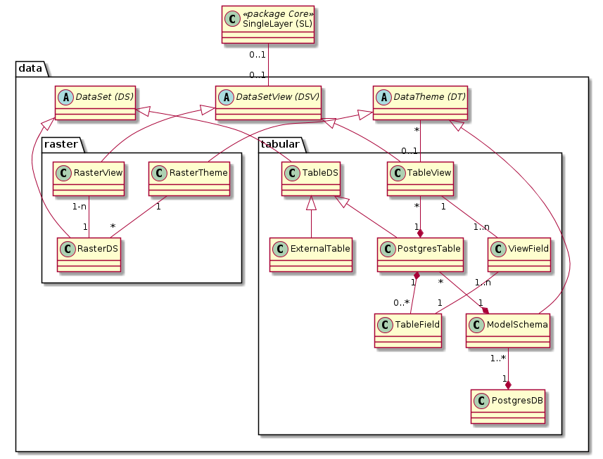

# Data

Stellt die Klassen des Datenkonfigurationsteils dar
* Tabellarische Daten aus Postgres/PostGIS mit und ohne Geometrie
* Rasterdaten aus einem File / einem Katalog

## Attribute

Umfasst die Eigenschaften eines Attributs einer PostgresDS. 

Bemerkungen:
* Die Namen der Attribute werden mittels Katalogabfrage aus Postgres gelesen.
* Zwei PostgresDS können auf dasselbe Attribut verweisen. Da dies aber nicht häufig vorkommt, wird auf eine 
Normalisierung verzichtet. Der Vorteil des einfachen Modelles überwiegt den Nachteil der punktuellen Doppelerfassung
von Beispielsweise des Feldes "description". 
* Der Attributname ist innerhalb eines PostgresDS unique. 

**Attributbeschreibungen:**

|Name|Typ|Z|Beschreibung|
|---|---|---|---|
|catSynced|boolean|j|Gibt an, ob das Attribut bei der letzten Katalogabfrage in der Datenbank vorhanden war.|
|catSyncStamp|DateTime|j|Gibt an, wann das letzte Mal mit dem Katalog abgeglichen wurde.|
|wmsFiFormat|String(50)|n|Python Formattierungs-String, welcher die Formatierung des Attributes für WMS GetFeatureInfo steuert.|
|wgcDisplayProps4Json|Json|n|Definiert Alias, Reihenfolge, Wertformatierung für die Properties eines Json-Feldes.| 

**Regeln:**
* wmsFiFormat: Darf nur gesetzt sein, wenn PostgresDS.wgcDisplayTemplate leer ist (Anwendung mit Default-Template).
* wgcDisplayProps4Json: Darf nur gesetzt sein, wenn PostgresDS.wgcDisplayTemplate leer ist,
 und es sich um ein json-Feld handelt.

## Dataset

Bei Vektor- oder tabellarischen Daten entspricht ein Dataset-Eintrag einer (Geo-)Tabelle. 
Bei Rasterdaten entspricht er einem Rasterlayer (Es werden keine nicht georeferenzierten Bilder erfasst).

### Beschreibung der Subklassen
* **PostgresDS:** Definiert basierend auf einer Postgres-Tabelle, welche Tabellenzeilen und -spalten gelesen.
 (und geschrieben) werden können. Die sprechenden Namen der Spalten (=Attribute) sind in der Klasse "Attributes" definiert.
* **VectorDS:** Repräsentiert eine PostGIS-Ebene. Erweitert PostgresDS mit den Darstellungseigenschaften.
* **RasterDS:** Repräsentiert eine dateibasierte Raster-Ebene. 

**Attributbeschreibungen PostgresDS:**

|Name|Typ|Z|Beschreibung|
|---|---|---|---|
|wgcDisplayTemplate|String|Jinja-Template, welches ein Custom-Rendering für das Attribut definiert.|

### Versionierung

Pro SingleLayer können maximal drei DataSet-Objekte mit jeweils anderer Versions-Enum vorkommen:
* Enum "current": Das aktuell "scharfe" DataSet für den Singlelayer. 
* Enum "next": Das kommende DataSet für den Singlelayer.
* Enum "previous": Das vorherige DataSet für den Singlelayer.

**Unique-Bedingung:** Mittels Unique-Key wird sichergestellt, dass für einen SingleLayer eine DataSet in beispielsweise der Version "next"
maximal einmal vorkommt.

## PostgresDS

Siehe Dataset

## PostgresSchema

Enthält die Eigenschaften eines Postgres-Schema. 

Eingeführt:
* Um der hohen Wichtigkeit des Schema als "Nachführungseinheit" Rechnung zu tragen.
* Den 1:1 Link zu den INTERLIS-Modellen herzustellen

## PostgresDB

Postgres-Datenbank, in welcher das Schema (PostgresSchema) enthalten ist. Universell adressiert mittels
* Datenbankname
* Hostname des PG-Clusters
* Port des PG-Clusters

## RasterDS

Siehe Dataset

## VectorDS

Siehe Dataset

