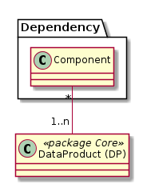

# Dependencies (Abhängige Komponenten)

Beschreibt die internen und externen Komponenten, welche von Artefakten der GDI abhängig sind.

Beispiele für Komponenten:
* Plan für das Grundbuch (intern)
* WMTS (intern) 
* BauGK (extern)
* ArtPlus (extern)

Beispiele für Artefakte:
* SingleLayer: Beispielsweise die Abhängigkeit auf das gegenwärtige Schema.
* Map: Abhängigkeit auf den Identifier der Map aufgrund Nutzung der URL-Schnittstelle zum WGC 

 

Modelliert sind auch Abhängigkeiten einer Fachapplikation auf eine Map oder eine Layergroup (Wie beispielsweise bei Baugis, ArtPlus der Fall)

Nicht Modelliert ist, auf welche Applikation / Service sich die Abhängigkeit bezieht (Ob auf WGC, WMS, DataService, ...)