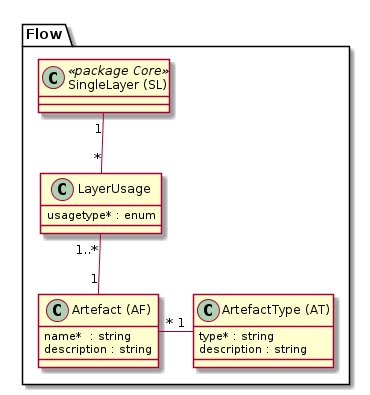

# Flow

Modelliert die Beziehungen des SingleLayer zu "Artefakten".

Die vorhandenen Artefakt-Typen werden mittels der Klasse "ArtefactType" verwaltet. Einträge aus heutiger Sicht:
* **Jobs**, welche aus n Quelldatensätzen m Zieldatensätze berechnen.
* **Reports**, welche jeweils auf 1 bis n SingleLayer zugreifen. Die Informationen werden sowohl im Sinne von "Know your GDI"
wie auch zur Zugriffsverwaltung verwendet.
* **Fachsysteme**, welche meist via Dataservice Informationen aus der GDI beziehen (und schreiben)

 Mit dem Attribut "usagetype" auf der Verknüpfungstabelle "LayerUsage" wird definiert, ob der SingleLayer vom Artifakt 
 lesend oder schreibend verwendet wird.

