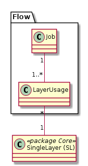

# Flow

Modelliert die Beziehungen von "Artefakten" (Jobs, Reports, ...) zu SingleLayer.

Die vorhandenen Artefakt-Typen werden mittels der Klasse "ArtefactType" verwaltet. Einträge aus heutiger Sicht:

## Klassenbeschreibung

### Artefact (AF)

Objekt, welches Informationen eines SingleLayer schreibt oder liest.

Bekannte Artefakt-Typen (Generisch abgebildet in Klasse "ArtefactType"):
* **Jobs**, welche aus n Quelldatensätzen m Zieldatensätze berechnen.
* **Reports**, welche jeweils auf 1 bis n SingleLayer zugreifen. Die Informationen werden sowohl im Sinne von "Know your GDI"
wie auch zur Zugriffsverwaltung verwendet.
* **Fachsysteme**, welche meist via Dataservice Informationen aus der GDI beziehen (und schreiben)

### ArtefactType (AT)

Selektierbare Objektarten (Job, ...).

**Unique-Bedingung:** Feld "name" muss eindeutig sein.

### LayerUsage

Attributierte Verknüpfungstabelle. Mit dem Attribut "usagetype" wird definiert, ob der SingleLayer vom Artifakt 
lesend oder lesend und schreibend verwendet wird.

Werte der Enumeration:
* **read** (default)
* **write_read**

### SingleLayer (SL)

Siehe package "core"
 
  
 

