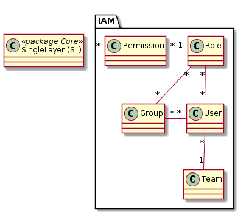

# IAM (Identity and Access Management)

Das IAM ist neu ausschliesslich Datenbezogen. Es gibt keine Anwendungsfälle, welche sich nicht immer
auf die Daten zurückführen liessen. Entsprechend werden die Berechtigungen einzig bezüglich des SingleLayer 
gesetzt.

## Permission

Steuert, ob eine Rolle gegenüber einer Ressource gar keine, nur lesende, oder lesende und schreibende Berechtigung hat.

### Attribute

|Name|Typ|Z|Beschreibung|
|---|---|---|---|
|level|Integer|j|Bei "2" hat die Rolle lesenden und schreibenden Zugriff, bei "1" nur lesenden.|
|priority|Integer|j|$td config.json anschauen.|

### Constraints

Unique über die Fremdschlüssel zu SingleLayer und Role.

## Role (PermissionSet)

Bündelt 1-n Permissions gegenüber 1-n SingleLayer

### Attribute

|Name|Typ|Z|Beschreibung|
|---|---|---|---|
|name|String(100)|j|Name der Rolle.|
|notes|String|n|AGI-Notizen zur Rolle.|

## Group

Meist organisatorisch bedingte Gruppe, welche die gleichen Rollen gegenüber SingleLayer hat. 

### Attribute

|Name|Typ|Z|Beschreibung|
|---|---|---|---|
|name|String(100)|j|Name der Gruppe.|
|notes|String|n|AGI-Notizen zur Gruppe.|

## User

Benutzer der GDI. Die Identität des Benutzers wird via SES des AIO verifiziert.

Es bestehen funktionale Einheiten der GDI mit eigenem (redundantem) Benutzerverzeichnis. Bsp: GRETL

### Attribute

|Name|Typ|Z|Beschreibung|
|---|---|---|---|
|name|String(100)|j|Name des Benutzers.|
|notes|String|n|AGI-Notizen zum Benutzer.|

### Constraints

Ein Benutzer soll grundsätzlich nicht direkt und indirekt via Gruppe der gleichen Rolle zugewiesen werden. Dies ist
aber eher wichtig, um die Übersicht zu behalten, als dass Missachtung des Constraints zum nicht Funktionieren der 
GDI führen würde. 