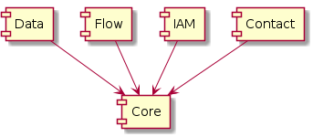

# Packages (Teilmodelle)

* **Core** Enthält die Kernklassen für die Gruppierung und Konfiguration 
von Datenprodukten (Datasets, Productsets, ...). [[Link]](core.md)
* **Data** Enthält die Klassen für die Beschreibung der von der GDI genutzten 
Datenquellen (GIS-Tabellen, Raster, ...). [[Link]](data.md)
* **IAM** Klassen zur Konfiguration des Identity und 
Access Management (Benutzer, Gruppen, Rollen, ...). [[Link]](iam.md)
* **Contact** Teilmodell zur Definition der Kontaktinformationen 
bezüglich der genutzten Daten. [Under construction] 
* **Flow** Modelliert die Informationsflüsse zwecks Übersicht der notwendigen Anpassungen bei
Schemaänderungen etc. [[Link]](flow.md)
* **CCC** Modelliert die einzelnen CCC-Integrationen (CCC-Client)[[Link]](ccc.md)

# Teilmodell Core

[Link auf Teilmodell "Core"](core.md)

## Anpassungen gegenüber dem Metamodell
    
### Baumtiefe (Theoretisch unendliche Verschachtelung von DataProducts)
    
Die unendliche Verschachtelung wird aufgelöst und in die Beziehungskette PS - DSL - SL überführt. 
Maximal mögliche Verschachtelung: Layergruppe (oder Map) enthält DataSets und Facadelayer. 
Facadelayer enthalten wiederum DataSets (Ueber Beziehung FL - DS)

### DataSet - DataSetView

Die Unterscheidung, ob eine Tabelle eine Geometriespalte hat oder nicht, erfolgt neu über eine Vererbungsbeziehung
und nicht über eine Assoziation. Die DataSetView entspricht neu der Klasse VectorDS. Im eher seltenen Fall der 
Publikation einer "Geotabelle" mit mehreren Darstellungen / unterschiedlichen Berechtigungen, ... müssen 
entsprechend mehrere VectorDS-Objekte erfasst werden. 

### TableOfContents

Als neue Klasse hinzugefügt, um die Verschachtelung der DataProducts aufzulösen

### ProductList ersetzt ~~ProductSet~~

Klassenname ProductList ersetzt ProductSet, da treffender. Grund: In der bisherigen Praxis sind die Kinder immer sortiert.

### LayerList ersetzt ~~Layergroup~~

Klassenname LayerList ersetzt Layergroup, da treffender. Grund: In der bisherigen Praxis sind die Kinder immer sortiert.

## Fragen - Todos

* Wie die meist zutreffende Komposition LayerList - SingleLayer abbilden? Bei Komposition können viele Informationen von 
"Mammi" vererbt werden, ohne dass diese nochmals erfasst werden müssen.

# Teilmodell Data

[Link auf Teilmodell "Data"](data.md)

## Anpassungen gegenüber Metamodell

### Versionierung der DataSets

Als Ablösung des improvisierten Tag "Bearbeitung" und zwecks Entschärfung des "Point of no return" bezüglich des 
Layer-Rollouts wird eine saubere Versionierung der DataSets eingeführt.

Dabei können einem SingleLayer maximal drei Datasets zugewiesen werden:
* **Previous:** Enthält die vorhergehende, nicht mehr gültige Konfiguration. Nutzen: Auf der Integration kann "Previous" 
kurzfristig reaktiviert werden, sofern "Current" stark verbockt ist. Sprich alle Aenderungen verwerfen und basierend
auf "Previous" neu starten.
* **Current:** Enthält die aktuell gültige Konfiguration.
* **Next:** Enthält die Entwurfsversion der neuen Konfiguration, welche auf der Integrationsumgebung aktuell 
erarbeitet wird.

Das Verhalten des zukünftigen "Magic-Button" wird damit von der Umgebung abhängen:
* In der Produktivumgbung wird immer "Current" verwendet
* In der Integrationsumgebung wird "Next" verwendet. Falls kein "Next" vorhanden ist, wird "Current" deployt

Im GUI des SingleLayer steht entsprechende Funktionalität zur Verfügung:
* Entwurfsversion anlegen
    * Stellt sicher, dass noch kein "Next" existiert. Falls existierend --> Abbruch
    * Erstellt ein neues "Next" und kopiert alle Eigenschaften des Current in das neue "Next"
* Entwurfsversion löschen
    * Löscht "Next", sofern dieses vorhanden ist
* Entwurfsversion publizieren
    * Löscht "Previous", sofern dieses vorhanden ist
    * Rename "Current" auf "Previous"
    * Rename "Next" auf "Current"
* "Previous" wieder herstellen
    * Löscht "Next", sofern vorhanden
    * Rename "Current" auf "Next"
    * Rename "Previous" auf "Current"
    
# Teilmodell Flow

[Link auf Teilmodell "Flow"](flow.md)

## Anpassungen gegenüber dem Metamodell

### Verwaltung der Abhängigkeiten ausschliesslich auf Stufe des SingleLayer

Es hat sich in der Praxis gezeigt, dass die Abhängigkeiten ausschliesslich auf Stufe des SingleLayer (DataSet)
gepflegt werden. Entsprechend "wandert" der Link von DataProduct "runter" auf SingleLayer.

### Zusammenführung alle Abhängigkeits-Aspekte

Durch das "Runterwandern" der Abhängigkeitsbeziehung auf den SingleLayer können die verschiedenen Abhängigkeitsaspekte
vereinigt modelliert werden.

Abhängigkeitsaspekte:
* **GRETL-Jobs**, welche aus n Quelldatensätzen m Zieldatensätze berechnen.
* **Reports**, welche jeweils auf 1 bis n SingleLayer zugreifen. Die Informationen werden sowohl im Sinne von "Know your GDI"
wie auch zur Zugriffsverwaltung verwendet.
* **Fachsysteme**, welche meist via Dataservice Informationen aus der GDI beziehen (und schreiben) 

# Modellierungsfragen

|Betrifft|Frage|Wer|Antwort|
|---|---|---|---|
|data.PostgresSchema|Wann sind die verwendeten Parameter der Schemaerstellung mittels ili2pg Teil des Model-Repos?|Stefan|?|
|data.PostgresDB|Verwendung der Service-Definition verstehen. Host und Port als Attribute ok?|Michael|?|
|data und core|Transparenz-Regeln verstehen.|Michael|?|
|data|Externe WMS-Ebene einbinden|Oliver|?|
|data|Wie die Raster in die GDI einbinden? Es gibt zu viele Möglichkeiten...|Oliver|?|

