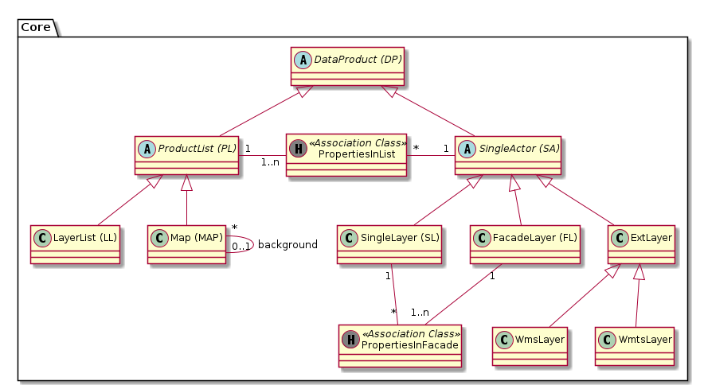

# Product

Bildet alle möglichen Arten von Kartenebenen und deren Beziehung untereinander ab.

## Klasse DataProduct (DP)

Basisklasse aller Datenprodukte.

Beispiel tabellarische Daten: Wenn ein DataProduct genau eine Tabelle umfasst ist es ein Objekt
der Subklasse SingleLayer, wenn es mehrere Tabellen umfasst ein Objekt der Subklasse Productset respektive FacadeLayer.

Der Dateninhalt von externen Diensten wird nach Bedarf ebenfalls als DataProduct geführt.
Beispiele:
* WMS-Ebene eines Nachbarkantones, welcher in eine vorkonfigurierte Karte des Kantons Solothurn aufgenommen wird.
* WMS-Ebene der Fachapplikation Altlast4Web welche in eine thematische Karte des Web GIS Clients eingebunden werden soll.

### Attributbeschreibung

|Name|Typ|Z|Beschreibung|
|---|---|---|---|
|identifier|String(100)|j|Eindeutiger hierarchischer Identifier des DataProduct (ch.so.fuu.bar).|
|inWGC|boolean|j|Steuert, ob das Dataproduct im WebGIS Client publiziert ist. Default: Ja|
|inWMS|boolean|j|Gibt an, ob die Ebene im WMS vorkommen soll. Default: Ja. Analoge Steuerung für DataService, WFS siehe data.PostgresDS.inDataService.|
|keywords|String(200)|n|Stichworte für das DataProduct. Können auch thematische Überbegriffe sein.|
|remarks|String|n|Interne Bemerkungen.|
|synonyms|String(200)|n|Synonyme für das DataProduct.|
|title|String(200)|n|Angezeigter Titel (Bezeichnung) des Dataproduct. Falls null in Erstellungsphase wird identifier verwendet.|

### Konstraints

Feld "identifier" ist GDI-weit eindeutig.

## "ProductList Klassen"

### Klasse ProductList

Sortierte Liste von Einzellayern (=SingleActor), welche im Web GIS Client „explodiert“ dargestellt wird.

Beispiele: 
* Sortierte Liste von Einzeldatensatzdarstellungen (=DataSet), die gemeinsam als Kinder eines WMS "Parent-Layer" dargestellt wirden.
* Sortierte Liste von SA's für eine Map

#### Attributbeschreibung

ProductList hat keine weiteren eigene Attribute.

### Klasse Map

Die enthaltenen SingleActor können aus beliebigen thematischen Kontexten zusammengesetzt sein.

Da eine Map häufig aus 1-n LayerList's zusammengesetzt wird: Im GUI wird eine Hilfsfunktion implementiert, 
mit welcher in der Karte noch nicht vorhandene SA's einer LL beigefügt werden können.

#### Attributbeschreibung

|Name|Typ|Z|Beschreibung|
|---|---|---|---|
|background|boolean|j|Gibt an, ob es sich um eine Hintergrundkarte handelt oder nicht.|

Bemerkung: Die Attribute inWGC und inWMS des Dataproduct sind für die Map immer "false". 

### Klasse LayerList (LL)

Die enthaltenen SingleActor haben einen engen thematischen Kontext.

#### Attributbeschreibung

LL hat keine weiteren eigene Attribute.

## Rund um Klasse SingleActor

### Klasse SingleActor (SA)

Einzelebene oder FacadeLayer. Verhält sich in den Clients immer wie eine einzelne Ebene. Die Kindebenen eines FacadeLayer
erscheinen beispielsweise nicht als WMS-Ebene und werden in der TOC des Web GIS Client nicht angezeigt.

#### Attributbeschreibung

SA hat keine weiteren eigene Attribute.

### Klasse FacadeLayer (FL)

Aggregationslayer, welcher von den Applikationen als ein Layer angesprochen wird.

Layereigenschaften wie Sichtbarkeit und Transparenz wirken sich nur auf den FacadeLayer als ganzes aus und nicht 
individuell auf die im Facadelayer enthaltenen Unterlayer. Die enthaltenen Unterlayer sind im TOC nicht sichtbar.

Beispiel: Plan für das Grundbuch.

#### Attributbeschreibung

FL hat keine weiteren eigene Attribute.

#### Bemerkungen

Die Anforderungen an das Modell bewirken, dass LayerList und Facadelayer neu im Modell "weit entfernt" sind.
Die Umwandlung von FL zu LL oder umgekehrt erfordert also etwas Handarbeit.

### Klasse SingleLayer (SL)

Einzelebene, welche die Daten aus 
* einer Postgres-Tabelle oder -View mit oder ohne Geometrie
* einem Geotif
* ...
bezieht.

#### Attributbeschreibung

SL hat keine weiteren eigene Attribute.

### Klasse PropertiesInFacade

Attributierte Verknüpfungstabelle der m:n Beziehung zwischen FL und SL.

#### Attributbeschreibung

|Name|Typ|Z|Beschreibung|
|---|---|---|---|
|sort|int|j|Sortierindex der Ebene innerhalb der ProductList.|
|transparency|int|j|Transparenz der Ebene in Prozent. Default: 0 (nicht transparent).|

#### Konstraints

UK über die FK's.

### Klasse ExtLayer

Externe Ebene, welche analog zu den internen Ebenen gesucht und in WGC und QGIS-Desktop geladen werden kann.
Laden in QGIS-Desktop mittels SO-Locator. 

Definition "Extern": Die Rohdaten der Ebene sind nicht als DataProduct erfasst. Gründe für nicht erfasste Rohdaten:
* Stammt aus Dienst eines Servers ausserhalb des Kantons Solothurn.
* Stammt aus Dienst einer Fachapplikation. 

#### Attributbeschreibung

Keine eigenen Attribute

### Klasse WmsLayer

Externe WMS-Ebene.

#### Attributbeschreibung

|Name|Typ|Z|Beschreibung|
|---|---|---|---|
|capabilitiesUrl|String(200)|j|URL für die "GetCapabilities" Abfrage des externen WMS.|
|layerList|String(1000)|j|Json-Array der Identifier der abzufragenden externen WMS-Layer.|

#### Konstraints

UK über wmsURL und identifier. 

### Klasse WmtsLayer

Als Ebene eingebundener externer WMTS.

#### Attributbeschreibung

|Name|Typ|Z|Beschreibung|
|---|---|---|---|
|capabilitiesUrl|String(200)|j|URL für die "GetCapabilities" Abfrage des externen WMTS.|

#### Konstraints

UK über wmsURL und identifier. 

## Klasse ProperitesInList

Attributierte Verknüpfungstabelle der m:n Beziehung zwischen PL und SA.

### Attributbeschreibung

|Name|Typ|Z|Beschreibung|
|---|---|---|---|
|sort|int|j|Sortierindex der Ebene innerhalb der ProductList.|
|transparency|int|j|Transparenz der Ebene in Prozent. Default: 0 (nicht transparent).|
|visible|boolean|j|Ist die Ebene in der ProductList per default sichtbar oder nicht? Default: Ja.|

### Konstraints

UK über die FK's.

# Beispiele

## Zusammenfassen von Geometrietypen in Facadelayer

Beipielsweise in der Archäologie werden kleine Denkmäler als Punktgeometrie, grosse als Polygon geführt.

### SingleLayer

|id|identifier|in_wms|in_wgc|
|---|---|---|---|
|s1|ch.so.ada.denkmal.punkt|false|false|
|s1|ch.so.ada.denkmal.polygon|false|false|

### FacadeLayer

|id|identifier|in_wms|in_wgc|
|---|---|---|---|
|f1|ch.so.ada.denkmal|true|true|

### PropertiesInFacade

|id_facadelayer|id_singlelayer|sort|
|---|---|---|
|f1|s1|10|
|f1|s2|5|

Keine Einträge in LayerList und PropertiesInList.

## Layergruppe (Productlist)

Zusammenfassung von Haltestellen und Netz zu Layergruppe öV.

### SingleActor

|id|identifier|in_wms|in_wgc|
|---|---|---|---|
|s1|ch.so.avt.oev.haltestellen|true|true|
|s2|ch.so.avt.oev.netz|false|false|

### LayerList

|id|identifier|in_wms|in_wgc|
|---|---|---|---|
|l1|ch.so.avt.oev|true|true|

### PropertiesInList

|id_productlist|id_singleactor|sort|
|---|---|---|
|l1|s1|10|
|l1|s2|5|

## Layergruppe mit externem WMS

Gruppierung des KBS mit dem KBS-WMS von Geodienste.ch

### SingleLayer

|id|identifier|in_wms|in_wgc|
|---|---|---|---|
|s1|ch.so.afu.kbs|true|true|

### ExtWmsLayer

|id|identifier|wms_url|in_wgc|
|---|---|---|---|
|w1|ch.kkgeo.kbs|https://geodienste.ch/db/kataster_belasteter_standorte_v1_4_0/deu?SERVICE=WMS&REQUEST=GetMap&LAYERS=kbs|true|

### LayerList

|id|identifier|in_wms|in_wgc|
|---|---|---|---|
|l1|ch.kbs|true|true|

### PropertiesInList

|id_productlist|id_singleactor|sort|
|---|---|---|
|l1|s1|10|
|l1|w1|5|

